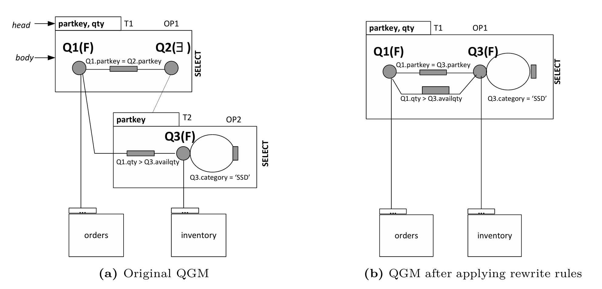
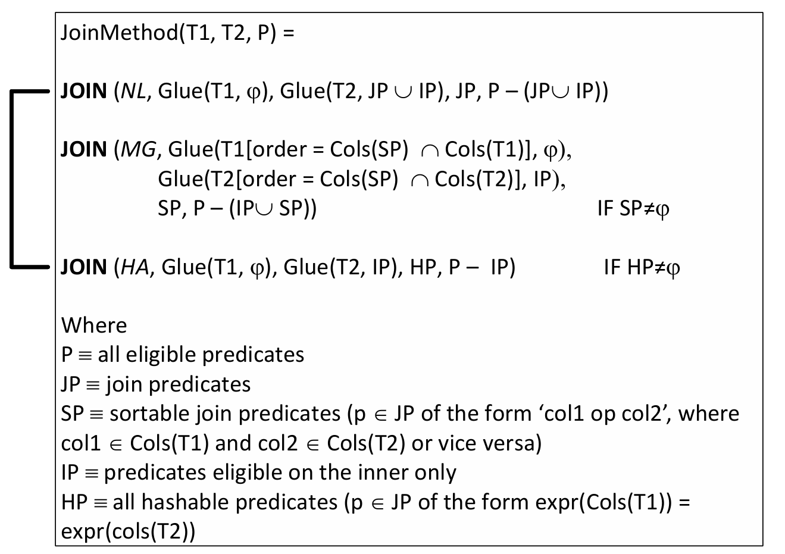

## QGM查询图模型

以下列嵌套查询为例，介绍一下starburst的查询图模型以及文中给出的两条rewrite rules的应用：

```sql
SELECT partkey, qty
FROM orders Q1
WHERE Q1.partkey IN (
    SELECT partkey
    FROM inventory Q3
    WHERE Q3.category = 'SSD'
        AND Q3.availqty < Q1.qty)
```



1. `SELECT XXX FROM XXX`：一个矩阵框表示该sql模板**OPn**
2. **head**部分表示输出列**Tn**
3. **body**
  - **Q1(F或∃或∀)**一个顶点表示一个迭代器，括号标注F代表全表扫描，∃量词和谓词**IN**对应，∀则和**ALL**对应(后面还有一个sql会演示)
  - **圆环**表示`Q3.category = 'SSD'`这样的单表谓词
  -  **顶点之间连线**则表示`Q1.qty > Q3.availqty`这样的两个表的元素的比较谓词

文章定义rules由一对函数表示，**condition function**和**action function**， 作用对象为QGM， 作用效果是生成另一个逻辑等价的QGM。和现在的rewrite rules使用保持一致：`if(condition) do action(QGM)`，以文中给出的两个rule为例：

1. Rule1 (Subquery to Join)
  - condition function：IF OP1.type == SELECT ^ Q2.type == '∃' ^ (在每次评估存在谓词时，T2至多有一个元组满足谓词)
  - action function：Q2.type = 'F' /** convert to JOIN */
2. Rule2 (Operation Merging)
  - condition function：OP1.type = SELECT ^ OP2.type == SELECT ^ Q2.type == 'F' ^ !(T1包含重复元组且OP2需要去重)
  - action function：merge OP2 into OP1;

存疑的点是文中说rule1是子查询转化为join操作，把Q2.type修为F后，可能是Q1和子查询生成的临时表做join后再投影到partkey, qty。不过我们不需要单独看rule1的效果：apply rule1后我们再次检查条件，满足rule2，则可以完全消除子查询：

```sql
SELECT Q1.partkey, Q1.qty
FROM orders Q1, inventory Q3
WHERE Q1.partkey = Q3.partkey
  AND Q1.qty > Q3.availqty
  AND Q3.category = 'SSD'
```

## Plan optimization phase

这部分内容可以分为下面几个子话题讨论

- 将plan的构建这一行为从语法分析类比过来进行讨论
- Starburst对表维护的metadata和glue机制
- Starburst中的连接枚举

Starburst的执行计划构建是自底向上的，类似语法分析中的自底向上解析，其中**简单元素**根据预定义的**规则**组合成更大的**结构**。在这个逻辑下，具体的物理操作符被定义为**终止符**（LOLEPOP，Low-Level Plan Operators），将这些操作符视为构建执行计划的**简单元素**，控制这些简单元素如何组合的规则称为**策略替代规则（Strategy Alternative Rules**，简称为**STAR**，即**非终止符**。

STAR是命名且参数化的，类似语法分析的结构可以通过添加新的LOLEPOP和STAR来扩展和修改系统。在上一LEC中提到，system R难以扩展更多的规则，像Starburst这样的可扩展优化架构成为了新一代优化器的基础。

Starburst中的每个表(包括子查询生成的临时表)都具有三种类型的属性：

1. **Relational Description**，表的schema，和其他表的关系，描述表在逻辑层次的内容
2. **Physical Properties**，数据是否按某列排序等，在物理存储和处理时的特性
3. **Estimated Properties**，一些基于统计信息的估计值，表的行数之类的

在自底向上构建计划的过程中，表的这些属性就会被传播到高层，确保构建的时候是基于底层子计划的信息。Starburst中引入了一个特殊的**Glue机制**，用于确保关系（或表）满足所需的属性。如果某个表的属性不符合操作的要求，Glue机制会插入额外的操作符来调整数据状态。比如MergeJoin要求输入表按特定顺序排序，但该输入表未排序，Glue机制会插入一个SORT操作符，确保输入表满足条件。该机制会评估所有可能的调整方式（例如插入不同的操作符或组合），并从中选择成本最低的替代方案，以在满足要求的同时保持计划的高效性。（相当于把SystemR中搜索join顺序时候保留interesting orders属性这一设计给抽象出来，成为一个组件或者机制了）

在join枚举中，Starburst和SystemR的方法差不多。不同点Starburst允许小表使用cross-product，避免复杂的条件计算、支持bushy plans，而不是left-deep plans。相比较而言，Starburst的搜索空间扩大了不少。



## Extensible/Rule Based Query Rewrite Optimization in Starburst

除了前面提到的select to join和select merge以外，这篇文章还提到了一些rewrite rules, 这里做一个汇总:

1. Subquery to Join Transformation
2. Set Operator to Subquery Conversion
3. view merge
4. Magic Sets Transformation
4. 

***rule2 in duckdb***

```sql
SELECT id FROM table_a EXCEPT SELECT id FROM table_b;

HASH_GROUP_BY
└── HASH_JOIN (SEMI)
    ├── SEQ_SCAN(table_a)
    └── SEQ_SCAN(table_b)
```

***rule3 in duckdb***

```sql
CREATE VIEW itpv AS
(
    SELECT DISTINCT itp.itemn, pur.vendn
    FROM itp, pur
    WHERE itp.ponum = pur.ponum AND pur.odate > '1985-01-01'
);

SELECT itm.itmn, itpv.vendn
FROM itm, itpv
WHERE itm.itemn = itpv.itemn
AND itm.itemn > '01' AND itm.itemn < '20';

PROJECTION(itmn, vendn)
└── HASH_JOIN (itm ⋈ *)
    ├── SEQ_SCAN(itm) -- 缺少filter
    └── HASH_GROUP_BY
        └── HASH_JOIN (itp ⋈ pur)
            ├── SEQ_SCAN(itp)
            └── SEQ_SCAN(pur) with filter
```

***rule4 in duckdb***

```sql


```

```sql
PRAGMA explain_output = 'physical_only';
PRAGMA explain_output = 'optimized_only';
PRAGMA explain_output = 'all';
```