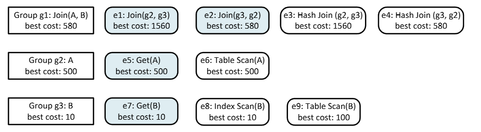
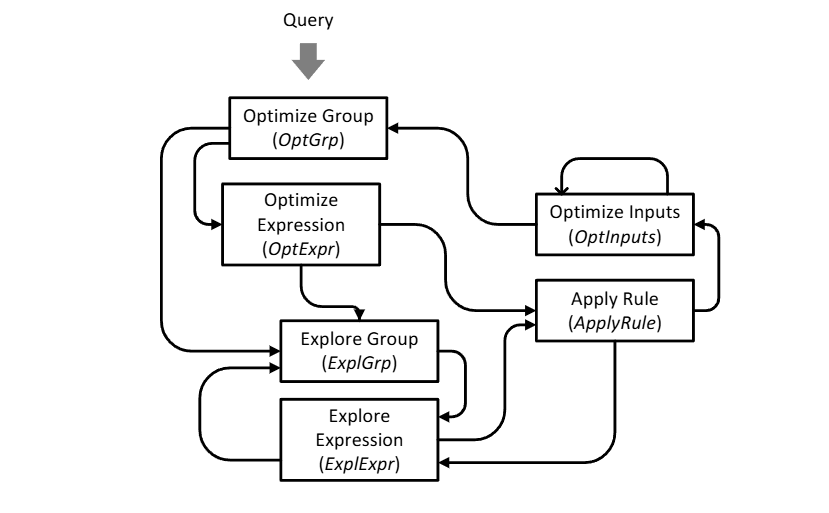

# Volcano

> Volcano: an extensible rule-based optimizer framework

## Insight

1. Enforcer：还记得SystemR中的interesting orders么，Volcano将这一类属性进行了泛化，提出了**Enforcer约束器**的概念。
2. Top-down search：与SystemR不同，Volcano使用自顶向下的记忆化搜索


## Search 

Volcano的搜索分为**生成阶段**和**成本分析阶段**。Volcano是自顶向下，采用记忆化的方式进行搜索的。

### memo

Volcano记忆化搜索用于缓存计划的数据结构称为**memo**，下图展示对于**A⋈B**，在memo中存储的逻辑视图：



- 一个group内的所有表达式产生相同的输出，因此对A⋈B而言，产生了3个组g1，g2，g3。
- 一个group内的表达式(图中e:=expr)是一个操作符，其子节点或者说输入的内容为另一个group
- 组内的表达式可以是逻辑表达式如e1，e2，也可以是物理表达式如e3，e4
- Volcano中每个表达式都会与一组逻辑属性或者物理属性相关联，图中仅展现了best cost属性

在生成阶段，memo缓存所有已生成的逻辑表达式，如果一次transformation生成了一个新的group的逻辑表达式，memo中则会添加一个group，如果生成了一个已存在group的新的表达式，则会为相应group添加该表达式。比如group2和group3是在递归变换表达式Join(A,B)时创建，$e2：Join(g_3，g_2)$则是应用join commutativity规则从$e1：Join(g_2，g_3)$变换而来。

在成本分析阶段，memo则缓存最优表达式及其物理属性，比如group1的最佳物理计划是$HashJoin(IndexScan(B)，TableScan(A))$，其最佳成本为580

### search

```c++
// 生成阶段
function GenerateLogicalExpr(LogExpr, Rules) {
  for child in LogExpr {
    if (Group(child) ∉ Memo) {
      // 更新Memo
      GenerateLogicalExpr(child);
    }
  }
  MatchTransRule(LogExpr, Rules);
}

function MatchTransRule(LogExpr, Rules) {
  for rule in Rules {
    if (Match(rule, LogExpr)) {
      auto NewLogExpr = Transfrom(rule, LogExpr);
      GenerateLogicalExpr(NewLogExpr);
    }
  }
}

// [in]
// LogExpr := 一个等价类, group
// PhyProp := 物理属性要求, 比如排序顺序
// Limit := 成本上限, 用于剪枝 (量化该规定的方式有许多)
// return: 给定LogExpr, 满足属性要求PhyProp, 代价最低的物理计划
FindBestPlan(LogExpr, PhyProp, Limit) -> Plan, Cost {
  // 记忆化剪枝
  if ([LogExpr, PhyProp] ∈ Memo ) {
    auto [plan, cost] = LookupBestPlan(LogExpr, PhyProp);
    if cost != null && cost <= Limit {
      return plan, cost;
    } else {
      return null, null;
    }
  }

  MarkInProgress(LogExpr, PhyProp);
  auto moves = GetAllMoves(LogExpr, PhyProp);

  // 按promise排序moves, 类似A*搜索的优先级队列, 优化搜索顺序
  SortMovesByPromise(moves);
  auto [best_plan, best_cost] = {null, +∞};
  
  // 三种类型的Move
  // - Transformation rules：逻辑变换规则，生成等价逻辑表达式
  // - Physical implementation rules：物理实现规则，将逻辑运算映射到物理操作符
  // - 约束器，用于确保物理属性(比如添加sort来满足有序的属性)
  for m in moves {
    if (m is transformation rule) {
      // 生成等效逻辑表达式
      auto neighbors = GetNeighbors(LogExpr, m);
      for new_LogExpr in neighbors {
        if (!InProgress(new_LogExpr, PhyProp)) {
          // 等价逻辑变换不改变成本和属性要求
          FindBestPlan(new_LogExpr, PhyProp, Limit);
        }
      }
    } else if (m is physical implementation rule) {
      // 比如将JOIN(A, B)映射到Hash Join(A, B)
      // HashJoin算法固定代价
      // 子计划代价: Get(A)和Get(B)
        auto total_cost = DeriveCost(LogExpr, m);
        vector<Plan> subPlans;
        // 递归收集子节点最优计划和代价
        for child in LogExpr {
          // 推导子节点需要的物理属性
          auto child_prop = DerivePhyProp(LogExpr, PhyProp, child);
          auto [plan, cost] = FindBestPlan(child, child_prop, Limit - total_cost);
          total_cost += cost;
          subPlans.push_back(plan);
        }
        // 生成完整物理计划并更新Memo
        auto phy_plan = CreatePlan(m, subPlans);
        UpdatePlan(best_plan, best_cost, phy_plan, total_cost)
    } else if (m is enforcer) {
        // 约束器添加属性开销, 比如sort操作的开销
        auto cost = DeriveCost(LogExpr, m);
        auto newProp = GetPhyProp(LogExpr, PhyProp, m);
        if (!InProgress(LogExpr, newProp)) {
          auto [plan, new_cost] = FindBestPlan(LogExpr, newProp, Limit - cost);
          UpdatePlan(best_plan, best_cost, plan, new_cost);
        }
    }
    Limit = min(Limit, best_cost);
  }
  Memo.Add(LogExpr, PhyProp, best_plan, best_cost); // 缓存plan
  return best_plan, best_cost;
}
```

上述是Volcano搜索最优物理计划的框架, 已经给了比较详细的注释, 但是还有一些需要更仔细的说明: 在`GetAllMoves(LogExpr, PhyProp)`和`SortMovesByPromise(moves)`处, 我们可以实现启发式选择moves的子集执行优化, 以及对move的优先级进行规定.

### Guidance


尽管记忆化的方式能够有效避免冗余计算，但对于复杂的查询，查询优化仍然可能非常昂贵。因此Volcano提供了额外的机制来限制搜索空间,并确定搜索顺序。这部分内容Volcano中没有细讲, 留到Cascades中会做详细的讨论.

### sum (Refrain ：待完善)

Volcano给出了一个比较完整的搜索算法，以apply rule的方式进行搜索也确实便于扩展：添加rule和物理操作符。同时可以看出，其搜索按照先apply transformation rules再apply implementation rules和enforcers这样2-pass的顺序进行，在Cascades中我们会看到更灵活的将这两个阶段交错起来的设计。

而关于并行search，可能Volcano做的也没有Cascades好。

# Cascades

Cascades是Volcano的改进，因此可以对比的来看，group、rule之类的概念都被保留了下来。

## Insight 

1. **Search efficiency**，主要是说像Volcano的2-pass会存在无用开销：在成本分析阶段应用一些启发式方法去限制搜索空间的时候，我们会发现第一个阶段生成所有的等价逻辑表达式是浪费的。因此在Cascades中这两个阶段是耦合的，会有一些按需生成/探索的优化。

2. `Cascades also abstracts the ad-hoc heuristics to scope the search space in Volcano into a first-class concept, i.e., the guidance object, which specifies the set of activated rules applied to an expression during the search.` (不懂 会不会类似于doris里面提到的TopicRules class)

3. **Task-based search algorithm**，`he Cascades framework replaces the recursive, depth-first search with a stack-based exploration using tasks`，文中说Volcano是基于search的，意思可能是call stack based，而Cascades是基于显示stack的深搜。因为Cascades把搜索过程拆分为了task，可以探索task之间的依赖关系，所以可以实现并行化搜索。还有一点优势是说可以根据经验值重排来自不同表达式的task。

4. **Improved software design** (吐槽：这也算亮点吗) Cascades在数据对象定义上做了些说明，比如实现operator class和rule class，logical/physical operator、transformation/implementation/enforcer rules作为子类，特别说明enforcer rule会在plan中插入physical operator来改变物理属性。

## Search

Cascades中的Search被细分为更细粒度的单元，称为task，以使搜索能够交错处理逻辑表达式和物理表达式的转换。这些task被实现为对象，因此可以轻松的进行重排序或并行处理，task被组织到栈中，默认情况下执行后进先出（LIFO）操作（或许可以扩展为图来利用其依赖关系）。与Volcano不同，Volcano分两个阶段：先穷尽应用所有transformation rules生成所有等价逻辑表达式，然后在优化阶段应用implementation rules。而Cascades采取按需探索和优化，避免不必要的穷尽枚举。



从图中可以看出，在宏观上来说分为4个大类的task，主要是对于处理group和expr代码是差不多的（通过Volcano的定义我们可以知道group就是expr的集合），也就是说**XxxGrp**的task实际上是在调用**XxxExpr**，

- **OptGrp**和**OptExpr**可以归为optimize expression一类
- **ExplGrp**和**ExplExpr**可以归为optimize expression一类
- **ApplyRule**
- **OptInputs**

### Workflow概述

与优化任务一样，探索任务也避免重复工作。是否已经探索了某个模式的决定是使用由 DBI 初始化和管理的一个“模式记忆”（pattern memory）来完成的。


另一方面，同一个组可能需要多次为不同的模式探索；如果是这样，可能会发生冗余规则应用和推导。为了避免这种情况，memo 结构中的每个表达式包括一个位图，指示已应用于它的转换规则，从而不应重新应用。

***1 OptGrp***

- 功能：优化一个group，即等价表达式集合，找到group中任意表达式的最佳计划
- 调度与被调
  1. 被Query调度代表整个query优化的起点
  2. 被OptInputs调度
  3. 调度OptExpr
  4. 调度ExplGrp用来生成输入表达式的等价逻辑表达式

***2 OptExpr***

- 功能：
- 调度与被调

***3 ExplGrp***

- 功能：
- 调度与被调

***4 ExplExpr***

- 功能：
- 调度与被调

***5 ApplyRule***

- 功能：对一个输入的表达式应用transformation或者implementation rules
- 调度与被调
  1. OptExpr和ExplExpr都会调度该task，区别在于传入的rule类型
  2. 

***6 OptInputs***

- 功能：
- 调度与被调