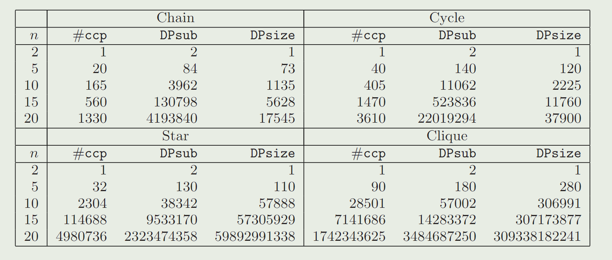
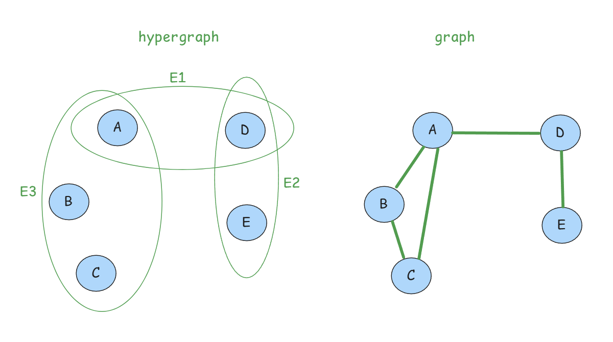
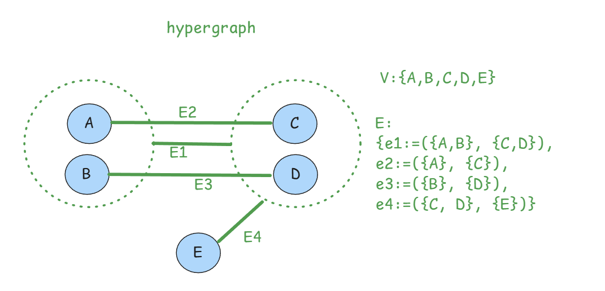
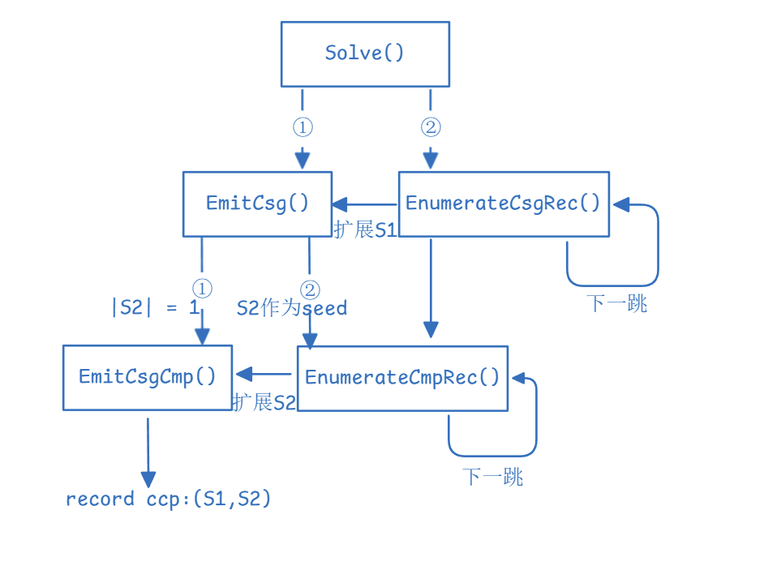

# BOOK

本章探讨了常用的变换规则，包括：
- 基表访问的访问路径变换（Access Path Transformations）
- 连接变换（内连接和外连接），用于重排序和实现。
- 分组与连接优化，用于将聚合推到连接下方。
- 嵌套子查询的去相关化，以提高效率
- 针对复杂查询和优化技术的高级规则

## Access Path Transformations

术语：**clustered/non-clustered index**、**include columns**

对于聚簇索引和非聚簇索引（也有的地方叫辅助索引）区别在于查询后是否需要回表，注意主键索引一般为聚簇索引。**include columns**是覆盖索引中的一个名词，$I_{a}(a,b,c)$这样的写法就表明以`a`为排序key，但是索引本身覆盖了`b`和`c`的值，好处在于对于被覆盖到的列值，是不需要通过回表查询的。

考虑有表S(id,a,b,c)，id作为主键，有以下索引：$I_{id}$、$I_{a}$、$I_{b}$、$I_{a}(a,b,c)$、$I_{b}(a,b,c)$。

1. 第一个sql例子
```sql
SELECT S.a, S.b
FROM S
WHERE S.a > 10 AND S.b = 20
```

当单个索引无法高效率的覆盖所有谓词的时候，比如上面的`WHERE S.a > 10 AND S.b = 20`，我们就可以考虑**索引交集**这种优化技术：优化器可以利用多个索引（每个索引覆盖部分谓词），通过交集操作合并结果，最终生成符合所有条件的行。对于索引和谓词我们应该考虑的事情，看以下几个数据就能明白了：

1. 单个索引可能无法高效覆盖查询中的所有谓词，如果访问表S的索引只覆盖了`S.a`，那么还需要对返回的行在`S.b`上做额外的检查
2. `S.a > 10`可能返回50%的行，而`S.b = 20`可能只返回0.1%的行，我们称之为**选择性**
3. 一张包含1亿行的表，在`S.a`上的索引查找`S.a > 10`返回5000w行数据，在`S.b`上的索引查找`S.b = 20`返回10w行数据，而两个索引返回行的交集可能只有几千行
4. 索引本身覆盖了查询输出的值，索引交集后能够直接输出结果

***Transformations***
```c++

```

## Join Transformations

ANSI-standard SQL:2003定义了5种类型的连接（Join）：inner join、left outer join、right outer join、fullouter join、cross join，还有用在谓词in/exists和no in/exists上的Semi join和Anti Semi join。可以参考下https://developer.aliyun.com/article/873193。

对连接顺序的讨论是优化器的重中之重，前面我们有说到过枚举连接的两个方案：Right/Left Deep Join Tree和Bushy Join Tree。我们暂时不考虑枚举方案带来的局限性，假设能枚举所有的连接顺序。InnerJoin只返回满足连接条件的行，而OuterJoin保留至少一个表中的所有行（考虑`R LEFT JOIN S ON R.a = S.b`，保留R表中的所有行，S表中不匹配的会用NULL填充）。对inner join的优化更自由一些，我们主要讨论的都是对inner join的优化，以及如何将outer join转化为inner join。

连接的性质即**交换律**和**结合律**，以及能够体现该性质作用的优化，可以参考hash join的build-side和probe-side的抉择考量来理解。谓词下推这样比较简单的rule也不过多介绍。贴一下转化的伪代码：

***Transformation 2：Join commutativity***
```c++
CheckPattern(expr) {
  if (expr.root = LogOpJoin)
    return True;
  else
    return False; 
}
Transform(expr) {
  return LogOpJoin(expr.right, expr.lef t, expr.joinCond);
}
```

***Transformation 3 Join right associativity***
```c++
CheckPattern(expr) {
  if (expr.root = LogOpJoin && expr.lef t = LogOpJoin)
    return True;
  else
    return False;
}
function Transform(expr) {
  auto newLeft = expr.lef t.left;
  auto joinCond = ExtractJoinCond(expr.left.right, expr.right, expr);
  auto newRight = LogOpJoin(expr.lef t.right, expr.right, joinCond);
  auto joinCond = ExtractJoinCond(newLeft, newRight, expr);
  auto newExpr = LogOpJoin(newLeft, newRight, joinCond);
  return newExpr;
}
```

***Transformation 4 Push down the predicate filter to the left child of the join***
```c++
CheckPattern(expr, i) {
  if (expr.root = LogOpJoin && expr.pred(i).cols ⊆ expr.left.cols)
    return True;
  else
    return False;
}
Transform(expr, i) {
  expr.left.pred.add(expr.pred(i));
  expr.pred.remove(i);
}
```

内连接可以使用多种连接方法实现，最常见的有**Nested Loops Join(NLJ)**、**Hash Join**和**Merge Join**，NLJ对谓词没有任何限制，而HashJoin只能作用于**equi-join(等值连接)**，MergeJoin要求其输入在Join作用列上有序。

***Transformation 5 Transform Join to Hash Join***
```C++
CheckPattern(expr) {
  if (expr.root == LogOpJoin && ExtractEquiJoinCond(expr) != NULL)
    return True;
  else
    return False;
}
Transform(expr) {
  auto joinPred = ExtractJoinCond(expr);
  auto equiJoinPred ← ExtractEquiJoinCond(expr);
  auto resPred = SubtractPred(joinPred, equiJoinPred);
  return PhyOpHashJoin(expr.left, expr.right, equiJoinPred, resPred);
}
```

某些情况下，外连接能被等价地转化为内连接。通过谓词判断，如果外连接的外侧表的**空值保留语义**能够被消除，那么二者就互相转换：

1. **null-rejecting predicates(空值拒绝)**
```sql
SELECT S.a 
FROM S LEFT OUTER JOIN R
ON S.id = R.id
WHERE R.a > 10;
```
`R.a > 10`过滤掉了`R.a = NULL`的行，因此这里的LOJ可以转化为InnerJoin

2. **结果集不感知空值**
```sql
SELECT sum(S.a)
FROM R LEFT OUTER JOIN S
ON R.a = S.a;
```
像sum这样的聚合函数，对于参数中的空值并不关心，因此可以转换为InnerJoin

3. **外侧表没有空值** 如果参与join的表，通过建表时的一些约束条件，优化器能推断出相应字段一定不为空值，也是可以转化为InnerJoin的

## Group-by and Join


# Join

在SystemR中，就已经见到过基于左深树和dp框架的Join order搜索算法，不过只是浅尝辄止，并没有深入多少，现在我们正式来讨论join order这个主题。

定义：**Join Graph := G=(V,E)**，其中顶点集V，每个顶点表示一张表，两个顶点之间的边代表这两个表存在连接谓词，如果两个表没有直接谓词连接则它们只能通过笛卡尔积连接，通常优化器都会推迟笛卡尔积。

**权重和扩展**：join graph的边上可以带权重表示join的代价估计，也可以维护更多的信息，如谓词的选择度、中间结果大小之类的。在Hypergraph扩展中，边可以是超边。、

## SystemR DP-based

在介绍具体算法前，先回顾SystemR中的DP框架：

- **子问题**：为子集$ S \subseteq V $找到最小代价的Join计划
- **状态**：子集S的最佳计划，包括cost、plan tree结构、Interesting Orders
- **代价模型**：
  1. 基数估计：SystemR假设谓词互相独立，中间表大小=子表大小乘积 * 所有谓词的选择度
  2. 总代价：W * RSI_calls + Page_fetched（RSI是存储系统接口，调用接口次数衡量CPU时间，而W是权重）
- **递推关系**：对于S = $S_1$+$S_2$
  1. cost(S)=cost($S_1$)+cost($S_2$)+join_cost($S_1$，$S_2$)
  2. 

## DPsize

DPsize是最早的DP算法之一，用于生成茂密树最优Join顺序。它按子集大小（Size）枚举，简单但有冗余：

```c++
// 初始化
for (auto p : allPlans) {
  BestPlan(p) = p;
}
// s1: left subplan size
// s2: right subplan size
for (int s = 2; s <= n; s ++) {
  for (int s1 = 1; s1 < s; s1++) {
    int s2 = s - s1;
    // type = vector<pair<Plan, Plan>>
    auto vec = GetSubplan(s1, s2);
    for (auto [S1,S2] : vec) {
      InnerCounter++; // 统计数据
      // check 包含了
      // 1: S1和S2无交集
      // 2: S1和S2连通且存在谓词连接
      if (check(S1, S2)) {
        CsgCmpPairCounter++; // 统计数据
        auto p1 = BestPlan(S1);
        auto p2 = BestPlan(S2);
        auto CurrPlan = CreateJoinTree(p1, p2);
        if (cost(BestPlan(S1 + S2)) > cost(CurrPlan)) {
          BestPlan(S1 + S2) = CurrPlan;
        }
      }
    }
  }
}
OnoLoHmanCounter = CsgCmpPairCounter / 2;
return BestPlan(V);
```

不同join graph下的复杂度（已简化）

- chain queries：5/48 * $n^4$ 
- cycle queries：1/4 * $n^4$ 
- star queries：$2^{2n-4} + n2^{n-1}$
- clique queries：$2^{2n-2} + C_{2n}^{n}$ （$C_{2n}^{n}$≈$O(4^n / \sqrt n)$）

## DPsub


- chain queries：5/48 * $n^4$ 
- cycle queries：1/4 * $n^4$ 
- star queries：$2^{2n-4} + n2^{n-1}$
- clique queries：$2^{2n-2} + C_{2n}^{n}$ （$C_{2n}^{n}$≈$O(4^n / \sqrt n)$）

## DPccp

> If the subgraph induced by S is connected, we call S a connected subset or simply connected. If there is a join predicate between a relation in S1 and another relation in S2, we call S1 and S2 connected.

定义**csg**为**ConnectedSubGraph（连通子图）**，**cmp**为**complement（互补）**

文章里还给出了一张统计图, 表示在不同类型的query graph以及表数量下, CsgCmpPair的数量和DPsize与DPsub进行扩展的总次数(InnerCounter的值)



如果说ccp的扩展是有效的，那么从图上能看到DPsize和DPsub进行了非常多的无效扩展，最高效的算法则是尽可能让扩展数接近真实ccp的数量。

- 枚举所有连通子图
- 给定一个连通子图S1时，枚举互补的连通子图S2
- 

### 枚举连通子图

在具体的算法之前，用一个简单的例子来看看一个join graph的所有连通子图：星型Join Graph，中心为B，周围是A，C，D，我们需要枚举出来的连通子图包括：

- size=1：{A}、{B}、{C}、{D}
- size=2：{B,A}、{B,C}、{B,D}
- size=3：{A,B,C}、{A,B,D}、{B,D,C}
- size=4：{A,B,C,D}

---

定义与性质：
- G = (V，E)是一个无向图
- 对于节点v∈V或节点子集S⊆V, 定义其邻域节点，即通过单边扩展的节点集合为：N(v)=$\{v'\mid(v,v')\in E\}$、N(S)=$\bigcup_{v \in S}N(v)\setminus S$
- 对N()，显然有性质：$N(S \cup S') = (N(S) \cup N(S')) \setminus (S \cup S')$

设S是无向图G的一个连通子集，S′是N(S)的任意子集，显然S∪S′是连通的。根据这一事实可以得到一个朴素的枚举思路：

0. 枚举所有节点$v_i \in V$
1. 选取$\{v_i\}$为第一个连通子图集合$S_0$，计算$N(S_0)$
2. 枚举所有非空子集$N \subseteq N(S_0)$，作为$S_0^{'}$递归到第一步中计算$N(S_0^{'})$

显然上述算法会产生重复子集，因此需要做改进。按照BFS的搜索顺序给节点依次编号：$V = \{v_0,...,v_{n-1} \}$，定义$B_i = \{ v_j \mid j \leq i \}$

```c++
// Input：G = (V, E)
// Precondition：V节点按BFS顺序编号
// Output：所有连通子集

void EnumerateCsg(G) {
  for (int i = n-1; i >= 0; i --) {
    emit {vi};
    EnumerateCsgRec(G, {vi}, Bi);
  }
}

// S: 起点集合
// X: 禁止扩展节点
void EnumerateCsgRec(G, S, X) {
  N = N(S) \ X;
  for all S′ ⊆ N {
    emit (S ∪ S′);
    EnumerateCsgRec(G, S∪S′, X∪N);
  }
}
```

以$v_1$为例子,形象的查看该算法扩展连通子集的路径

- {1}
   - -> {1,4}
      - -> {1,4,2}
      - -> {1,4,3}
      - -> {1,4,2,3}

### 枚举连通子图的补图

我们还需要生成所有的CSG-CMP pairs。容易想到的一个思路，由于前面我们已经得到了所有的连通子图，遍历所有连通子图，对每个子图S，再遍历N(S)的每个节点$v_i$，作为起始子集$\{v_i\}$，复用EnumerateCsgRec扩展所有包含该节点连通子图，以此得到S通过该节点相匹配的所有pair

同样的, 我们需要避免生成重复的CSG-CMP pairs, 采用和枚举连通子图一样的思路。定义$\text{min}(S) := \min(\{i \mid v_i \in S\})$，$B_i(W) := \{v_j \mid v_j \in W, j \leq i\}$

```c++

// Input: G = (V, E), 连通子图S1
// Output: complements S2 for S1 such that (S1, S2) is a csg-cmp-pair
void EnumerateCmp(S1) {
  X = B_min(S1) ∪ S1;
  N = N(S1) \ X;
  for (vi : N) { // i取降序
    emit {vi};
    EnumerateCsgRec(G, {vi}, X ∪ B_i(N));
  }
}
```

### Proof

DPccp算法的正确性依赖于连通子图-补图对（CSG-CMP Pairs）的正确枚举, 因此只需要证明**EnumerateCsg****、EnumerateCsgRec**和**EnumerateCmp**的正确性即可。

***Lemma 1. EnumerateCsg的有限递归性质 ***

这是关于安全性的证明，即如果G是有限图，那么枚举算法能够在有限时间内完成。EnumerateCsg的终止依赖于EnumerateCsgRec的递归终止，如果EnumerateCsgRec对于任何输入G, S, X都能在有限时间内完成，不难推出枚举连通子图的算法也能在有限时间内结束。

递归深度分析，通过N = N(S) \ X不难看出，继续递归依赖于N(S)和X，由于算法中每一轮递归都会往X中至少添加本轮扩展得到的N(S)，我们可以形象地把EnumerateCsg的扩展看成**从vi一点出发，步长为1地往外扩展**。由于G的有限性，EnumerateCsg的递归深度上限应该为length(vi,vj)的最大值。因此我们可以说，**递归深度最大为|V|，即链式的join graph**。

***Lemma 2. EnumerateCsg只会枚举出连通子集***、***Lemma 3. 给定节点，其n代邻居构成一个连通子集***
定义:
- $E_{|V'} = \{(v,v') \in E | v,v \in V' \}$, 即V'相关的边集
- $N_i(v)$表示从v这一点开始，往外扩展i次的节点，即离v距离为i的节点集合，或者说v的第i代邻居

依赖于引理1中的形象理解，实际上是数学归纳的体现，我们容易推出引理2和引理3的正确性。引理2是说EnumerateCsg中emit的集合都是连通子图，引理3是在说对于$V_n^{'}=\bigcup_{0 \leq i \leq n} N_i(v)$，$(V_n^{'}, E_{|V_n^{'}})$是一个连通子集，对于引理2是自然的，对于引理3，如果需要补充的话，可以说N(S)和S构成连通子图，递推能得出v的n代邻居构成的集合也是连通子集。

***Lemma 4. 给定节点，在图中存在n满足任意i≤n有该节点第i代邻居不为空，且任意i>n有第i代邻居为空***

一个事实是$N_{i}(v)=∅$可以推出$N_{i+1}(v)=∅$，只要理解了第i代邻居的含义就不难理解n的存在性和|V|相关，也就是我们在引理1中讨论过的事情。

***Lemma 5. 给定一个连通子集，其一定存在可去点***

***Lemma 6. EnumerateCsgRec的递归扩展不会减少连通子集***、***Lemma 7. EnumerateCsg枚举所有单顶点连通子集***、***Lemma 8. EnumerateCsg的完备性***

引理6~7过于朴素，对于引理8，假设并非所有连通子图都被枚举，即存在非空子集$V' \subseteq V$构成一个连通子图，我们选择|V'|最小的一个，引理7告诉我们|V'|大于1，引理5告诉我们至少可以从V'中剔除一个点仍然保持连通性，由于|V'|是最小的没有被枚举的连通子图，因此通过引理5剔除后的V' \ v一定被枚举过，在枚举V' \ v时，即参数S=V' \ v的时候，v一定∈N(S)，根据引理6对EnumerateCsgRec的扩展性保证，可以知道V'一定被枚举过，假设错误，因此引理8是正确的。

***Lemma 9&10. EnumerateCsgRec的枚举方式具有无重复性***

由于在枚举的时候我们初始化X为$B_i = \{ v_j \mid j \leq i \}$，因此一个连通子图中下标最小值，一定是算法枚举的起点，且可以唯一标识该连通子图，这便是引理9的内容。

假设存在$V' \subseteq V$至少被枚举过两次，同样的，我们选择|V'|最小的一个。

1. |V'|=1，根据引理7，以及EnumerateCsgRec的调用上下文可以知道，对于单节点的连通子集，必定由EnumerateCsg单次执行，因此不可能被枚举两次。
2. |V'|>1，根据引理9，两次V'的枚举都是从同一个起点v开始的，而单次调用不可能生成两次V'。

此外我们还需要说明从不同参数的EnumerateCsgRec调用不会生成同一个V'

***Lemma 11&12. EnumerateCsgRec按子集逆序从小到大逐步分层枚举连通子集***

---

和EnumerateCsgRec的证明思路类似, 对EnumerateCmp的正确证明也有如下几个:

- ***Lemma 13. EnumerateCmp在有限图上终止***
- ***Lemma 14. EnumerateCmp枚举了所有单顶点的连通子图***
- ***Lemma 15. EnumerateCmp仅枚举补图中的相邻连通子图***
- ***Lemma16. EnumerateCmp枚举所有满足序关系的相邻连通子图***
- ***Lemma17. EnumerateCmp 仅枚举每个连通子图一次***

## DPhyp

### Hypergraph

G := (V,E)，超图H同样定义为点和边的二元组，与普通graph不同在于扩展了e(e∈E)的定义：

- 普通的图"edge"由两个顶点定义，而超图中的"edge"允许多个顶点，或者您可以视为带有关系的子集V'∈V。
- 从建模的角度看，普通图的边表示两个顶点的某种二元关系，而超图边，称为**hyperedge**超边，表示一种高阶关系，不局限于二元，而是一种集合关系



***hyperedge***

DPhyp中超边定义为一组无序pair(u, v)，u,v⊂ V且无交集。一条超边对应着一个join predicates，比如A.a + B.b + C.c = D.d + E.e，那么会建立一条超边:({A,B,C}, {D,E})，

***subgraph***

V' ⊆ V 是节点子集


***connected***

超图的连通性，对比普通图，图是连接的，意味着从任何一个顶点可以通过边到达其他任何顶点。而超图中边连接的是顶点集合，类似地，我们需要考虑超图如何定义顶点的“链接性”：

***Neighborhood***

在DPccp中，枚举算法的正确性很大程度依赖于邻居节点的定义，在DPhyp中也一样。而扩展邻居这个问题，在hypergraph中变的略显复杂，在普通图中，给定S扩展N(S)只需要逐一枚举S中的顶点，而对于超图来讲，我们除了考虑单一顶点以外，还需要考虑任意数量顶点组成的集合，这让枚举的复杂度变得很高。关于超图中邻居的定义，不管是原论文还是我找到的一些文章，感觉讨论的都比较模糊，问题在于前面的定义有些奇妙，这里通过**形象地简述**、**准确的符号定义**以及**实际例子说明**三个角度尽可能详尽的解释这个概念。

---

***形象地描述这个过程***

1. Input：现有的顶点集合S和exclusion set X
2. 遍历顶点集S中的**有效子集 u**（min(S)是为了服务子集遍历算法而定义的，我们的重点不是子集遍历算法。可以暂时忽略）
3. 对每个子集u，查询超边集合E，通过e=(u,v)找到扩展子集v，将不在S和X中的v加入到$E_\downarrow'(S, X)$中
4. **最小化**集合$E_\downarrow'(S, X)$，操作上来说是去重，逻辑上来说邻居之间会存在包含关系，比如{C,D}和{C}都能作为扩展的邻居节点集合，我们只保留{C,D}就可以了
5. Output：取每个邻居节点集合v的min(v)作为唯一标识，记录到N(S,X)作为这次扩展邻居的结果

---

***按照原文的定义描述***

- 超节点：在扩展连接子图的时候，超节点需要作为一个整体来处理
- 快速子集枚举：作者采用了Vance和Maier的方法，使用bit vector来标识一个超节点（tbd 需要更详细的解释为什么需要代表节点）。因此算法需要为每个超节点分配一个唯一的代表节点。文章中采用的是min(S)，即超节点代表的节点集合中编号最小值。
- We define the set of **non-inclusive hyperedges** as the minimal subset $E_{↓}$ of E。即E的最小子集，满足对任意$(u,v)∈E$，存在$(u',v')∈E_{↓}$，有$u' \subseteq u，v' \subseteq v$
- 给定两个顶点集合S和X，分两步构造**interesting hypernodes**：
   - 构造$E_\downarrow'(S, X) = \{ v \mid (u, v) \in E, u \subseteq S, v \cap S = \emptyset, v \cap X = \emptyset \}$，可以看成遍历给定顶点集合S中的所有子集u，查询边集，将满足上述条件的超边(u,v)中的v加入到$E_\downarrow'(S, X)$中
   - 最小化$E_\downarrow'(S, X)$，得到$E_{↓}$，相当于去重

有了上述的准备，我们才可以定义邻居：$N(S, X) = \bigcup_{v \in E_\downarrow(S, X)} \min(v)$。

---

***结合一个实际的例子***



设置初始S={A, B}，X={A, B}，遍历子集：{A,B}、{A}、{B}，通过超边找到扩展的节点集合：{C,D}、{C}、{D}，因此$E_\downarrow'(S, X) = \{\{C, D\}, \{D\}, \{C\}\}$，最小化后得到$E_\downarrow(S, X) = \{\{C\}, \{D\}\}$

***算法***



```c++
class DPhyp {
 public:
  // 主入口
  auto Solve() -> DPTable;

  // 为所有满足 (S1, S2)构成ccp的S2生成seeds
  auto EmitCsg(S1);

  // 扩展S1的所有连通子图
  auto EnumerateCsgRec(S1, X);
  
  // 以S2为起点，扩展所有S1的ccp
  auto EnumerateCmpRec(S1, S2, X));

  // merge 一对cpp S1和S2，生成新计划
  auto EmitCsgCmp(S1, S2);
}
```

---

```c++
DPTable Solve(HyperGraph H) {
  for (auto v : H.V) {
    dpTable[v] = v.plan;
  }
  /*
    此处枚举的是单顶点，而不是一个集合。
    1、先生成csg-cmp-pairs ({vi}, S2)
    2、再生成csg-cmp-pairs ({S1}, S2)
    B_vi的定义和作用和DPccp中一样
  */
  for (int i = n; i >= 0; i --) {
    EmitCsg(H.V[i]);
    EnumerateCsgRec(H.V[i], CreateB(i));
  }
  return dpTable;
}
```

---

```c++
EmitCsg(S1) {
  X = S1 + CreateB(min(S1));// B_{min(S1)}
  /*
    (S1={1,2},S2={3,4})考虑在Neighborhood中的定义，通过N(S1, X)得到
    的集合实际上是min(S2)=3，因此我们需要识别出该条边是({1,2},{3,4})
    而不是({1,2},{3})，所以文章中提到的检查连通性指的是检查上面描述的情况
  */
  N = N(S1, X);
  for (auto v : N) {
    /*
      如果真的存在({1,2},{3})这条边，那么加入该邻居节点
      换句话说，这里通过边S1--S2扩展的邻居|S2| = 1
    */
    S2 = {v};
    if (Check(S1, S2)) {
      EmitCsgCmp(S1, S2);
    }
    // 扩展S2，处理|S2| > 1的邻居节点
    EnumerateCmpRec(S1, S2, X);
  }
}
```

---

```c++
/*
  Input：两个构成csg-cmp-pair的顶点集合
  负责将S1和S2的最优计划进行连接
*/
EmitCsgCmp(S1, S2) {
  plan1 = dpTable[S1];
  plan2 = dpTable[S2];
  S = S1 + S2;
  /*
    计算连接S1和S2的超边的谓词的合取，通过将谓词绑定在顶点集上：
    P_s := {P(u,v) | (u,v)∈E, u ⊆ S}，并且用bit vector记录
    该操作就只需要计算p_S1 ∩ p_S2就可以了
  */
  p = S1.p & S2.p;
  newPlan = plan1 ⋈ plan2;
  if (dpTable.contain(S) || cost(newplan) < cost(dpTable[S])) {
    dpTable[S] = newplan;
  }
  // for commutative ops only
  newplan = plan2 ⋈_p plan1;
  if (cost(newplan) < cost(dpTable[S])) {
    dpTable[S] = newplan
  }
}
```

---

```c++
/*
  通过EmitCsg调用，S2作为扩展S1的ccp的seed，不断扩展S2为S2'
  将与S1构成ccp的S2'加入到dpTable。和DPccp一样，从S2出发
  逐跳扩展出所有符合要求的ccp，大体思路和DPccp枚举连通子图一样
*/
EnumerateCmpRec(S1, S2, X) {
  for (auto N : N(S2, X)) {
    /*
      和DPccp中不同的是我们需要考虑EmitCsg中传入的参数，
      如何从({1,2},{3})扩展到({1,2},{3,4})，注意到这里枚举
      的N依旧是min(S)，因此：
      1、如果存在超边({3},{4,...})那么问题解决
      2、如果不存在，那么我们建立的简单边就起效果了
    */
    if (dpTable.contain(S2 + N) && Check(S1, S2+N)) {
      EmitCsgCmp(S1, S2 + N);
    }
  }

  // 下一跳
  X = X + N(S2, X);
  for (auto N : N(S2, X)) {
    EnumerateCmpRec(S1, S2+N, X);
  }
}
```

---

```c++
EnumerateCsgRec(S1, X) {
  for (auto N : N(S1, X)) {
    /*
      在DPhyp的调用链路上，可以发现扩展S2先于S1
      因此连通性可以直接查表得知
    */
    if (dpTable.contain(S1 + N)) {
      EmitCsg(S1 + N);
    }
  }
  for (auto N : N(S1, X)) {
    EnumerateCsgRec(S1 + N, X + N(S1, X));
  }
}
``` 